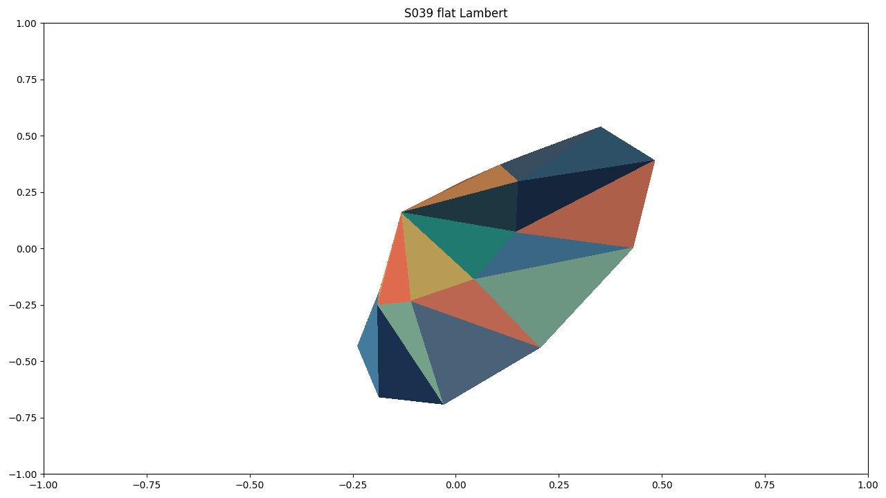
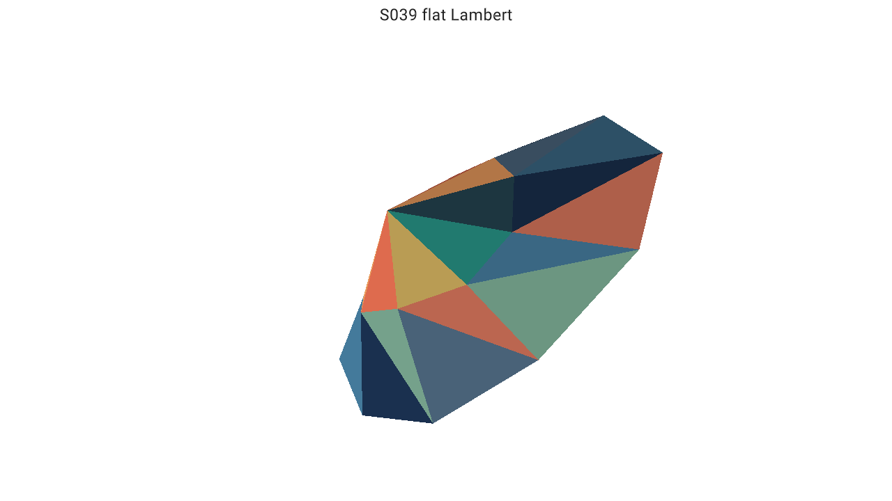

# Backend comparisons

These captures were regenerated from maintained current-protocol review examples at 1280x720. They
show concrete executions, not a claim of global backend parity.

## View3D terrain

| Matplotlib | Datoviz v0.4 |
|---|---|
|  |  |
| Adapted 3D reference raster path. | `review.adapted`: retained mesh rendering succeeded; title layout is adapted and guide-query geometry is unsupported. |

## Flat Lambert mesh

| Matplotlib | Datoviz v0.4 |
|---|---|
|  |  |
| Reference color resolution with adapted 3D rasterization. | `review.adapted` for the complete scene because title and guide-query behavior are not strict. |

Capture provenance and classifications are recorded in `docs/screenshot_provenance.md`. Visual
similarity supports review but cannot promote a capability without semantic runtime evidence.
