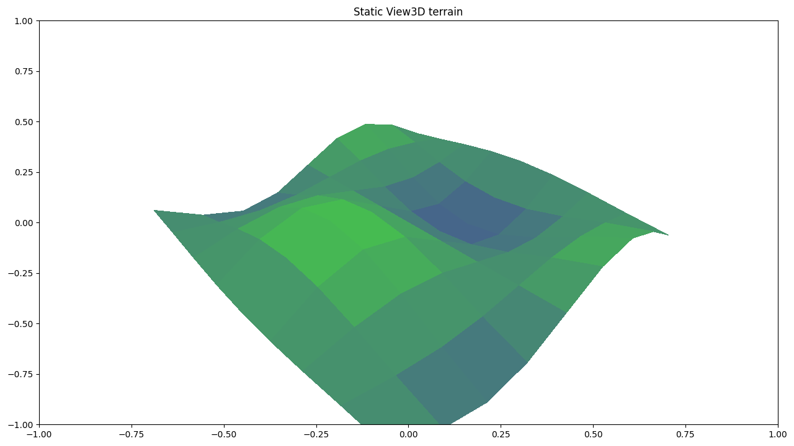
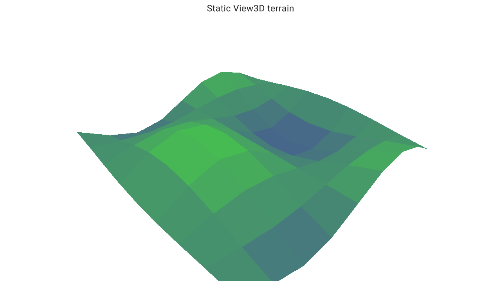

# Graphics Server Protocol

**Describe a scientific visualization once, then execute it through a backend that declares what it can do.**

GSP is an experimental semantic protocol for 2D and 3D scientific visualization. A producer such as GSP VisPy2 creates validated scene records. A GSP session negotiates capabilities, accepts operations, and delegates supported work to a backend adapter. Matplotlib defines reference behavior; Datoviz v0.4 provides capability-gated GPU paths.

!!! warning "Research prototype"
    GSP 0.2 and the independent `gsp_vispy2` producer are source-only prototypes requiring Python 3.13 or newer. APIs can change, and backend support is intentionally uneven.

[Build a first scene](getting-started/first-scene.md){ .md-button .md-button--primary }
[Understand the architecture](concepts/architecture.md){ .md-button }

## One protocol, explicit support

```text
GSP VisPy2 / domain library / direct records
                  |
                  v
       GSP session and protocol
       commands, resources, queries
                  |
          capability negotiation
                  |
                  v
            backend adapter
           /               \
  Matplotlib reference    Datoviz v0.4 GPU
```

Protocol meaning does not depend on JSON, a network connection, or one renderer. The local path can carry Python objects, NumPy arrays, and memory views directly. Remote and binary transports are architectural targets, not current production claims.

## See the same scene

| Matplotlib reference | Datoviz v0.4 |
|---|---|
|  |  |
| Reference rendering; this 3D raster path includes documented adaptations. | Capability-gated retained rendering; the complete capture is `review.adapted` because title layout and guide-query geometry are not strict. |

These captures show executions of the same protocol scene. Similar output is useful review evidence, but it does not by itself prove that all backend semantics are identical.

## Choose your path

| You want to... | Start here |
|---|---|
| Learn what GSP changes | [What is GSP?](getting-started/what-is-gsp.md) |
| Run a current example | [First scene](getting-started/first-scene.md) |
| Integrate protocol records | [Architecture and roles](concepts/architecture.md) |
| Check whether a backend supports a feature | [Feature matrix](support/feature-matrix.md) |
| Review exact semantic contracts | [Specification](specification/index.md) |

## Current boundary

The protocol defines semantic visuals, views, guides, resources, transforms, navigation, queries, capabilities, and diagnostics. The Python repository already exposes these records and executable reference renderers. A complete application-facing session that executes every `CommandBatch` against Matplotlib or Datoviz is still under development; the documentation distinguishes that target lifecycle from the executable record-level paths available today.
